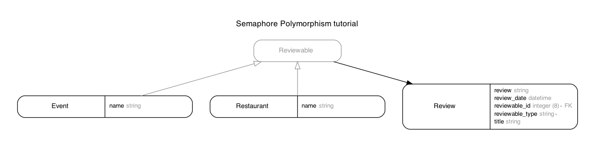

# README

This project follows the [semaphore polymorphism tutorial](https://semaphoreci.com/blog/2017/08/16/polymorphic-associations-in-rails.html).

Some changes as using Rails `6.0.3.3`. Also added the `rails-erd` gem to get an erd.

## Adding records

Although a full scaffold was originally produced, the code doesn't (yet) support adding records via the web browser.

To try the code out:

```bash
event = Event.create
restaurant = Restaurant.create

review_1 = Review.create reviewable: event
review_2 = Review.create reviewable: restaurant
```

This creates a record in each of the event and restaurant tables, and two records in the reviews table.

```bash
Review.all
# Review Load (0.4ms)  SELECT "reviews".* FROM "reviews" LIMIT $1  [["LIMIT", 11]]
=> #<ActiveRecord::Relation [
#    &lt;Review id: 1, review_date: nil, title: nil, review: nil, created_at: "2020-09-21 14:22:04", updated_at: "2020-09-21 14:22:04", reviewable_type: "Event", reviewable_id: 1&gt;,
#    &lt;Review id: 2, review_date: nil, title: nil, review: nil, created_at: "2020-09-21 14:22:38", updated_at: "2020-09-21 14:22:38", reviewable_type: "Restaurant", reviewable_id: 1&gt;
#    ]&gt;
```bash
